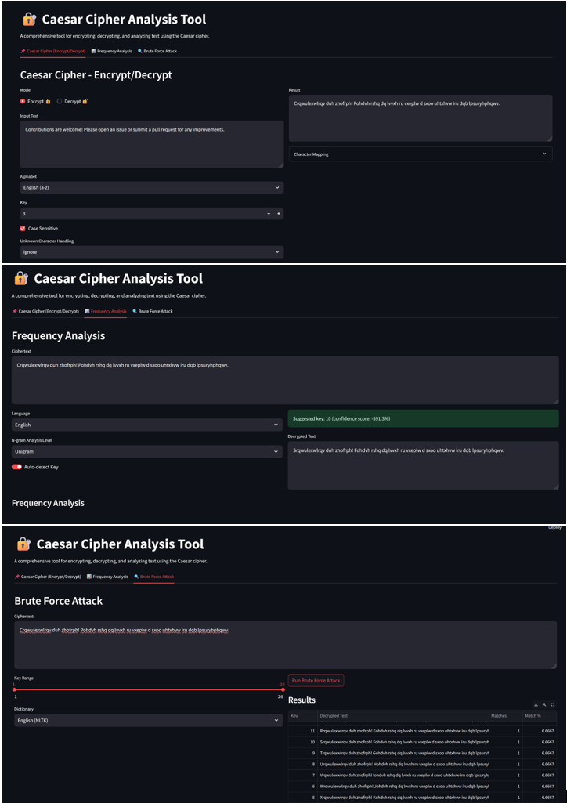

# 🔐 Caesar Cipher Analysis Tool

A comprehensive Streamlit application for encrypting, decrypting, and analyzing text using the Caesar cipher with frequency analysis and brute force attack capabilities.



## Features

- **Encryption/Decryption**: Perform Caesar cipher transformations with customizable alphabets
- **Frequency Analysis**: Compare ciphertext frequencies with language norms to suggest likely keys
- **Brute Force Attack**: Test multiple keys against a dictionary to find plausible decryptions
- **Visualizations**: Interactive frequency comparison charts
- **Export Options**: Save results as PDF, CSV, or PNG images

## Installation

1. Clone the repository:
   ```bash
   git clone https://github.com/yourusername/caesar-cipher-tool.git
   cd caesar-cipher-tool
2. Install the required dependencies:
   ```bash
   pip install -r requirements.txt
3. Download NLTK data (for dictionary attacks):
   ```bash
   python -c "import nltk; nltk.download('words')"
4. Usage
Run the application with:
```bash
streamlit run main.py
